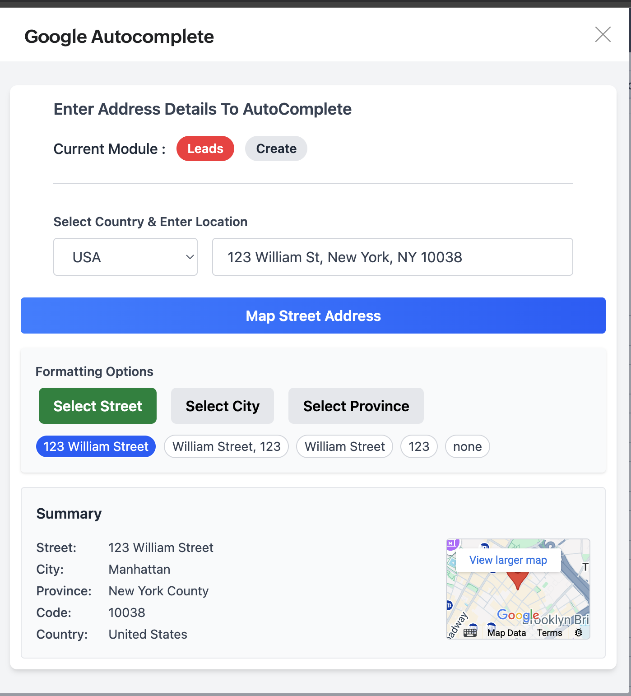

# 🧠 Zoho CRM Address Autocomplete Widget

> A powerful Zoho CRM widget that integrates **Google Places Autocomplete** to autofill address fields and display live map previews. Built with React and the Zoho Embedded App SDK.

---

## 🔥 Features

- 🗺️ Google Places Autocomplete integrated directly into Zoho CRM.
- 🧠 Autofills key fields like **Street, City, Province, Postal Code, Country**.
- 🔍 Interactive **map preview** beside the summary box.
- 📍 On-click map expansion using a modal for a better location overview.
- 🚀 Built with modern UI using **React + Tailwind CSS**.
- 🧩 Easy integration via Zoho Embedded App SDK.

---

## 🛠️ Tech Stack

- **React**
- **Tailwind CSS**
- **Zoho CRM SDK**
- **Google Maps & Places API**

---

## 📸 Preview

 

---

## 🧪 How It Works

1. User starts typing an address in the input field.
2. Google Places Autocomplete suggests locations.
3. Once selected, the widget:
   - Parses and fills the fields in Zoho CRM.
   - Displays a small map beside the summary.
4. Clicking the map opens an interactive modal with an embedded Google Map.

---

